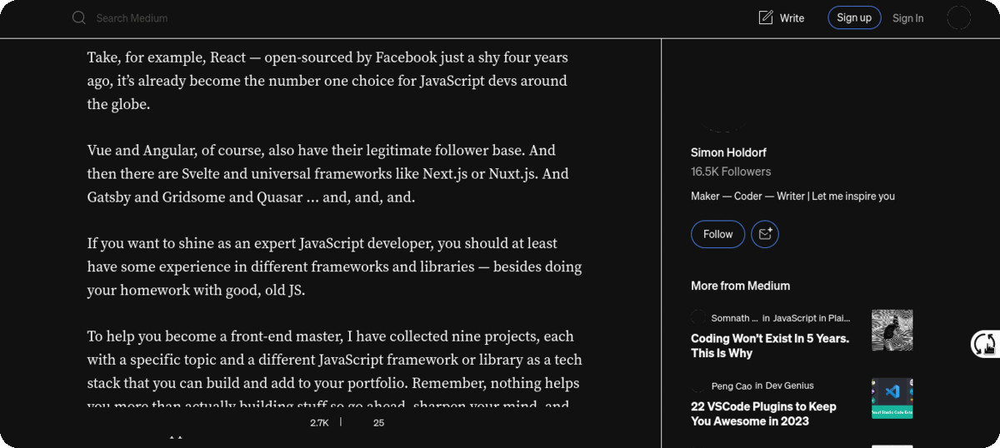

# 
DarkReader

This script provides an easy way for you to switch to a dark mode, even on websites that don't natively support dark themes. This is particularly useful for long articles or pages, as dark mode can help reduce eye strain and improve readability in low light conditions. The switch button is conveniently located on the bottom right-hand side of the webpage for easy access. With this script, you can quickly toggle between light and dark mode to optimize your browsing experience.

## Usage

Enable Dark Reader rule in Requestly after importing them. see [here](../README.md) for instructions on how to import rules.

That's it! You're all set to use Dark Reader. you will find a switch button on the bottom right-hand side of the webpages.

  

 
    
    

