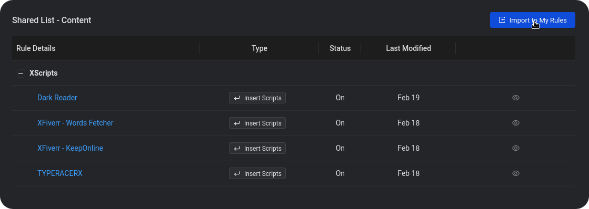
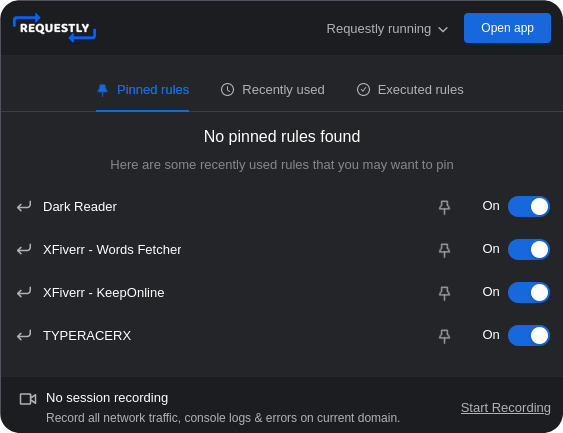

# 
XScripts - Web

XScripts - WEB where I share my collection of simple, fun scripts that automate processes and add some excitement to your browsing experience! Whether you're looking to prank your friends with a silly website hack or automate a repetitive task, you'll find something here to help. My scripts are designed to be easy to use and work with popular browser extensions like Requestly, so you can start having fun right away.

## Usage

1) Install the [Requestly](https://requestly.io/) browser extension, which is available for all popular browsers.
2) Import our script rules [here](https://bit.ly/rxs_i). 
  

3) Once you've imported the rules, you can enable or disable individual rules as needed from the Requestly extension popup.
  

4) Simply navigate to the targeted website(s) and the scripts will automatically run in the background, based on the enabled rules.

 
    
    

