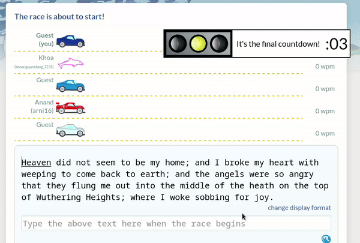

# 
RaceBreaker

This script is a simple tool designed for entertainment purposes, intended to be used with [Typeracer](https://typeracer.com) - a platform dedicated to enhancing users' typing skills through virtual car races. By using this script, you can aim to type faster than your friends and leave them impressed with your typing abilities. Doesn't that sound fun? 🤪

## Usage

1. Enable TYPERACERX rule in Requestly after importing them. see [here](../README.md) for instructions on how to import rules.

2. Once you've imported the rule, you're ready to go! 🎉 You can now enable the turbo mode and join any race. The script will take care of simulating your typing, leaving you free to enjoy the extra speed! 😁

  

#### 📍NOTE: Please note that if you type faster than 100wpm while using the script, you will be prompted to take a test. You can choose to skip the test and keep racing if you prefer. However, please be aware that using the script on your main Typeracer account may result in a ban, so it's recommended to use a secondary account or sign in as a guest to ensure the safety of your primary account.

 
    
    

