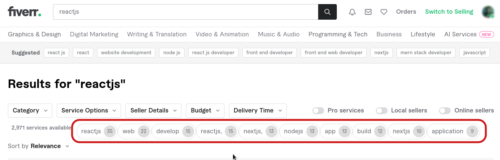

# 
XFiverr

XFiverr contains two useful scripts for Fiverr users that automate certain tasks on the platform:

`keep-online.js`: script sends periodic pings to the Fiverr API to keep you online on the platform automatically. This can increase your appearance as an active user on Fiverr.

`keywords-fetcher.js`: is a script that extracts the titles of the gigs on a Fiverr search results page, counts the occurrence of the words in the titles, and displays the top 10 most common words on the page. This can help you filter for the top common words that you can use in your gigs to increase your visibility in search results on Fiverr.

## Usage

1. Enable XFiverr rules in Requestly after importing them. see [here](../README.md) for instructions on how to import rules.
2. Just navigate to the Fiverr website and the scripts will automatically run in the background. (pin the Fiverr tab to keep it open)
- `keep-online.js`: will automatically keep you online on Fiverr while the Fiverr tab is open in your browser's navigation bar. The script will play a notification sound to indicate that it is running.
- `keywords-fetcher.js`: will display the top 10 most common words on the search page.
 

 
    
    

