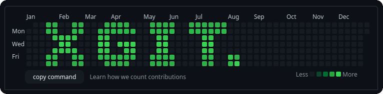
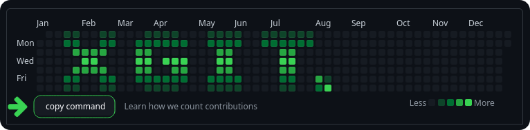

# <p align="center" id="xgitdraw">XGitDraw</p>

This script was created specifically to facilitate drawing on your GitHub contributions calendar using the [xgit](../../linux/XGit/) command-line tool. By selecting dates on the calendar and generating a command that reproduces the same contribution pattern, this script makes it easier for users to create custom contribution calendars that reflect their personal or organizational goals.

<p align="center"><br/><a href="#xgitdraw" title=""></a></p>

## Installation

To use this script, you must:

1. Copy the script code from this repository or from the raw [here](https://raw.githubusercontent.com/AimadBahdir/XScripts/main/web/XGitDraw/xGitDraw.min.js).
2. Navigate to your GitHub profile page.
3. Open your browser console (typically by pressing Ctrl+Shift+i or Cmd+Option+i and go to the Console tab).
4. Paste the script code into the console and press Enter to run the script. You will need to run the script every time you want to use it.
5. Install the xgit command-line tool on your Linux system by following the instructions on the [xgit](../../linux/XGit/) directory.

## Usage

1. Click on the dates you want to include in your contribution calendar. Each click will increase the contribution count for that date by one.
2. Right-click on a date to decrease its contribution count by one.
3. Click the "copy command" button to copy the command to your clipboard.<p align="center"><br/><a href="#xgitdraw" title=""></a></p>
4. Make sure that you have installed the xgit command-line tool on your Linux system.
5. Open your terminal, navigate to the specified repository where you want to generate the contribution calendar.
6. Paste the copied command in your terminal and run it to generate a new contribution calendar with the selected dates.
it will look something like this: 
```bash
xgit -l "01/01/2023,01/20/2023,01/30/2023 ..."
```
<br/>
We hope you find this repository helpful and that it enhances your GitHub profile. If you have any questions, suggestions, or feedback, please don't hesitate to reach out to us or create an issue on this repository.
<p align="center"><br/>
    <a href="https://github.com/AimadBahdir/XScripts#gh-dark-mode-only" title="XScripts"></a>
    <a href="https://github.com/AimadBahdir/XScripts#gh-light-mode-only" title="XScripts"></a>
</p>